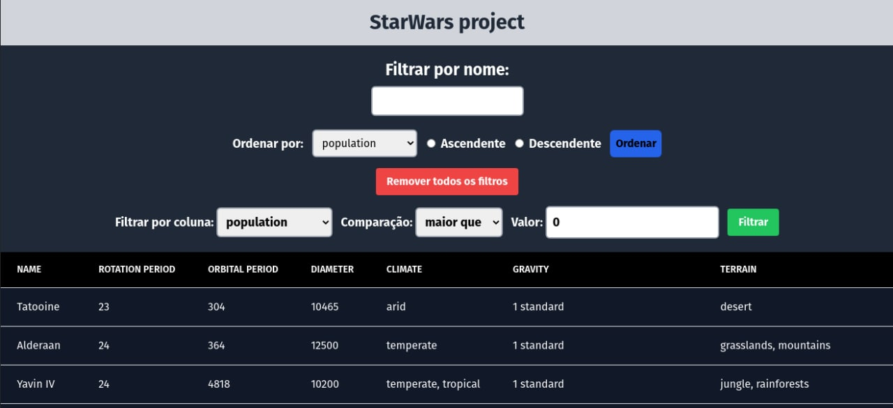

[PT-BR](./README_pt-br.md)
[EN-US](./README.md)

# Star Wars Planets Search Project

---

## Welcome to the Star Wars Planets Search project repository!

This project was developed during the Trybe Web Development course. The objective was to develop an application that consults the Star Wars Planets API and returns information about the planets, and can also perform filters and sorts.

---

## Preview

---

## Developers

- [Lucas Ximenes](https://www.linkedin.com/in/lucasdximenes)

---

## How to run the project

1. Clone the repository

- `git clone git@github.com:lucasdximenes/starwars-project.git`
- Enter the repository folder you just cloned:
  - `cd starwars-project`

2. Install dependencies

- `npm install`

3. Run the application

- `npm start`

4. Access the application in your browser

- `http://localhost:3000`

---

## How to run the tests

1. Use the `npm test` command to run the tests

2. Use the `npm run test-coverage` command to check test coverage

---

## How to run Linters

1. To run JavaScript Linter use the command `npm run lint`

2. To run CSS Linter use the command `lint:styles`

---

## Used languages, dependencies, APIs and libs

- [React](https://pt-br.reactjs.org/)
- [Tailwind CSS](https://tailwindcss.com/)
- [React Testing Library](https://testing-library.com/docs/react-testing-library/intro/)
- [Jest](https://jestjs.io/)
- [prop-types](https://www.npmjs.com/package/prop-types)
- [Eslint](https://eslint.org/)
- [Stylelint](https://stylelint.io/)
- [SWAPI](https://swapi.dev/)

---

## Acquired knowledge

- Use React to create web applications
- Use Functional Components with Hooks
- Use third-party API
- Develop unit tests
- Develop asynchronous tests
- Use Tailwind CSS to style web applications
- Use React Testing Library to test web applications
- Use Jest to test web applications
- Use Eslint to standardize the code
- Use Stylelint to standardize the code

---
